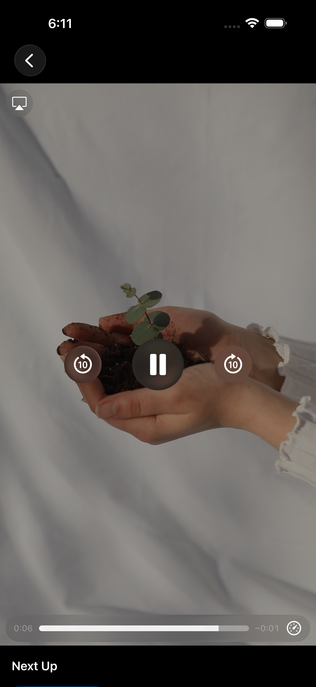
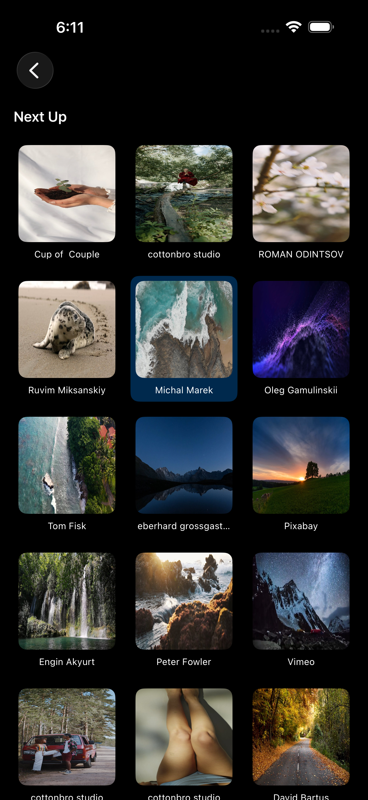

# 🎥 Video Player App

Developed a dynamic, two-page mobile application that leverages the Pexels API to provide a seamless video discovery and playback experience.

---

## 🚀 Features

- Video grid listing (Home Screen)
- Video playback using AVKit
- “Next Up” section with 3-column grid
- Autoplay next video
- Smooth navigation and UI experience

---

## 🏗️ Architecture

- MVVM (Model-View-ViewModel)
- Clean separation of concerns

---

## 🛠️ Tech Stack

- SwiftUI  
- AVKit  
- Combine / Async-Await  
- URLSession  

---

## 📸 Screenshots

### 🏠 Home Screen

### ▶️ Player Screen

### ⏯️ Player Controls

### 📋 Next Up Grid

### 🔽 Next Up Scroll

---

## 🎥 Demo Video

<video src="Screenshots/VideoPlayerApp.mov" controls width="300"></video>

---

## 📌 Notes

- Designed for smooth UX and performance
- Efficient rendering using LazyVGrid
- Stable video playback with autoplay functionality

---

## 👩‍💻 Author

Ragini M
ragini.official2722@gmail.com
